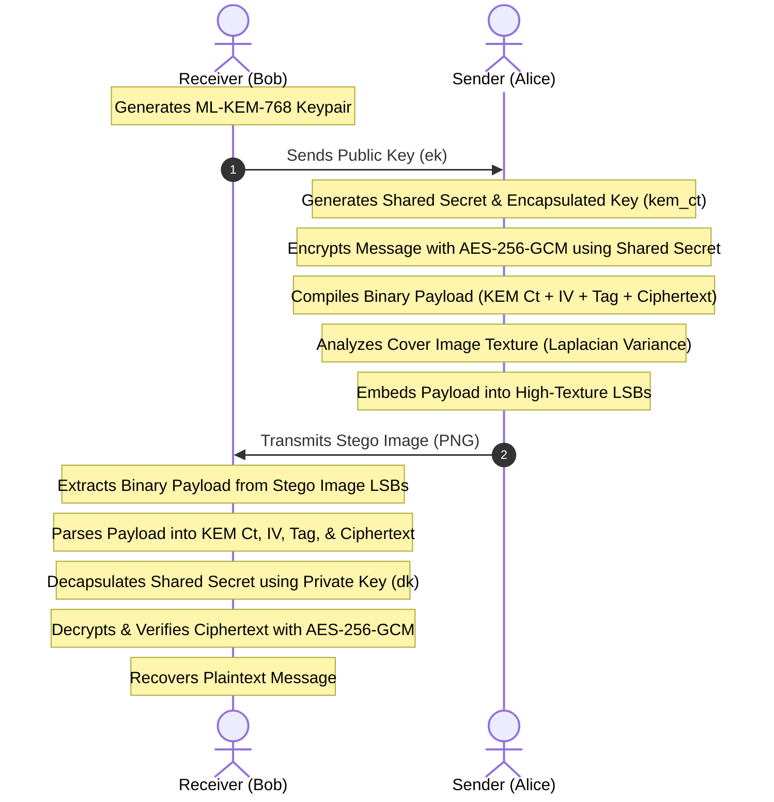

# Project Report: PQCSecure — Post-Quantum Secure Data-Transmission System

**Date:** August 2, 2026  
**Status:** Completed  
**Target Environment:** Local & IoT/Edge Nodes (e.g., Raspberry Pi 4)  

---

## Table of Contents
1. [Executive Summary](#1-executive-summary)
2. [Problem Statement & Objectives](#2-problem-statement--objectives)
3. [System Architecture & Workflow](#3-system-architecture--workflow)
4. [Cryptographic Layer Specifications](#4-cryptographic-layer-specifications)
5. [Steganography & Adaptive Hiding Layer](#5-steganography--adaptive-hiding-layer)
6. [Steganalysis & Dual-Defense Mechanism](#6-steganalysis--dual-defense-mechanism)
7. [Experimental Benchmarks & Performance Analysis](#7-experimental-benchmarks--performance-analysis)
8. [Testing & Verification Framework](#8-testing--verification-framework)
9. [Security Considerations & Deployment Guidelines](#9-security-considerations--deployment-guidelines)
10. [Conclusion & Future Work](#10-conclusion--future-work)

---

## 1. Executive Summary

**PQCSecure** is an advanced, secure data-transmission prototype designed to counter the emerging threat of quantum computing while maintaining metadata stealth. The system integrates post-quantum key encapsulation (**ML-KEM-768**), authenticated symmetric encryption (**AES-256-GCM**), and **Adaptive Least Significant Bit (LSB) Steganography**. 

By hiding encrypted payloads containing quantum-safe ciphertexts inside high-texture regions of cover images, PQCSecure protects both the content of the transmission and its metadata profile. Built-in live statistical stegananalysis (Chi-Square) and a machine-learning-based Stego Detector (Random Forest) provide active risk evaluation prior to transmission. A dedicated IoT benchmark suite ensures compatibility and high performance on edge hardware such as the Raspberry Pi 4.

---

## 2. Problem Statement & Objectives

### The Quantum Threat
Shor's algorithm poses a fatal threat to traditional public-key cryptography. Widely used algorithms such as RSA and ECDH rely on the difficulty of integer factorization and discrete logarithms, problems that quantum computers can solve in polynomial time. Consequently, secure communication channels must migrate to post-quantum alternatives.

### The Metadata Anomaly Threat
Migrating to post-quantum algorithms introduces a physical side-channel: **payload size scaling**. For instance, while an ECDH public key is only 32 bytes, a FIPS 203 ML-KEM-768 public key spans **1,184 bytes**. Transmitting large, raw cryptographic keys over constrained IoT networks or public networks triggers firewall alerts and alerts passive eavesdroppers of encrypted communication channels.

### Core Objectives
1. **Quantum-Safe Exchange:** Establish shared keys resilient against quantum attacks using ML-KEM-768.
2. **Stealth Transmission:** Embed public keys and ciphertexts within cover images to evade visual inspections and traffic profiling.
3. **Adaptive Resistance:** Minimize statistical modifications to the carrier image by prioritizing noisy, high-texture blocks.
4. **Active Defense:** Provide immediate feedback on the detectability of the stego carriers using statistical and machine-learning detectors.
5. **Edge Viability:** Demonstrate low-latency operation suitable for Raspberry Pi 4 class devices.

---

## 3. System Architecture & Workflow

The PQCSecure ecosystem consists of three main modules:
*   **`pqcsecure-backend/`**: A Flask-based REST API that processes key generation, encryption, adaptive LSB embedding, payload packaging, stego analysis, and decryption.
*   **`pqcsecure-frontend/`**: A Vite-powered React UI featuring step-by-step playgrounds, interactive system architecture maps, live dashboards for image metrics, and steganalysis indicators.
*   **`pi_benchmark/`**: A standalone optimization and measurement suite developed for direct compilation and speed runs on Raspberry Pi 4 edge hardware.



---

## 4. Cryptographic Layer Specifications

PQCSecure supports three key exchange algorithms (ML-KEM-768, X25519, and RSA-2048) and two symmetric encryption modes (AES-256-GCM and AES-256-CBC).

### Key Encapsulation Mechanisms (KEM)
1.  **ML-KEM-768 (Lattice-Based):** Standardized under FIPS 203 (derived from CRYSTALS-Kyber). It relies on the hardness of the Module Learning With Errors (M-LWE) problem. Operates at NIST Category 3 security (equivalent to AES-192).
    *   *Public Key Size:* 1,184 bytes.
    *   *Ciphertext Size:* 1,088 bytes.
2.  **X25519 (Elliptic Curve):** Classical baseline using Curve25519 for Ephemeral Diffie-Hellman key exchange. Safe against classical attacks, but vulnerable to quantum computer attacks.
    *   *Public Key Size:* 44 bytes.
    *   *Ciphertext Size:* 44 bytes.
3.  **RSA-2048 (Integer Factorization):** Legacy classical baseline. Highly computationally expensive key generation.
    *   *Public Key Size:* 294 bytes (DER format).
    *   *Ciphertext Size:* 256 bytes.

### Symmetric Encryption
*   **AES-256-GCM (Recommended):** Authenticated Encryption with Associated Data (AEAD). Protects confidentiality and integrity. Uses a 12-byte random initialization vector (IV) and outputs a 16-byte authentication tag.
*   **AES-256-CBC:** Legacy block cipher mode. Uses a 16-byte IV and PKCS#7 padding. Requires a secure MAC if integrity is required.

### Binary Payload Packing Schema
To transport the required cryptographic variables in a single image channel, the backend packs components into a contiguous binary stream with a **10-byte dynamic header**:

```
 0                   1                   2                   3
 0 1 2 3 4 5 6 7 8 9 0 1 2 3 4 5 6 7 8 9 0 1 2 3 4 5 6 7 8 9 0 1
+-+-+-+-+-+-+-+-+-+-+-+-+-+-+-+-+-+-+-+-+-+-+-+-+-+-+-+-+-+-+-+-+
|                      KEM Ciphertext Length                    |
+-+-+-+-+-+-+-+-+-+-+-+-+-+-+-+-+-+-+-+-+-+-+-+-+-+-+-+-+-+-+-+-+
|                      Symmetric Msg Length                     |
+-+-+-+-+-+-+-+-+-+-+-+-+-+-+-+-+-+-+-+-+-+-+-+-+-+-+-+-+-+-+-+-+
|    IV Length  |   Tag Length  |                               |
+-+-+-+-+-+-+-+-+-+-+-+-+-+-+-+-+                               |
|                                                               |
|                 KEM Ciphertext (Variable Length)              |
|                                                               |
+-+-+-+-+-+-+-+-+-+-+-+-+-+-+-+-+-+-+-+-+-+-+-+-+-+-+-+-+-+-+-+-+
|                     IV (Variable Length)                      |
+-+-+-+-+-+-+-+-+-+-+-+-+-+-+-+-+-+-+-+-+-+-+-+-+-+-+-+-+-+-+-+-+
|                    Tag (Variable Length)                      |
+-+-+-+-+-+-+-+-+-+-+-+-+-+-+-+-+-+-+-+-+-+-+-+-+-+-+-+-+-+-+-+-+
|              Symmetric Ciphertext (Variable Length)           |
+-+-+-+-+-+-+-+-+-+-+-+-+-+-+-+-+-+-+-+-+-+-+-+-+-+-+-+-+-+-+-+-+
```

---

## 5. Steganography & Adaptive Hiding Layer

Steganography embeds the binary payload into the Least Significant Bits (LSB) of cover images. In basic LSB steganography, data is written linearly from pixel 0, leaving a distinct footprint in flat regions. PQCSecure resolves this with **Adaptive Texture-Based Steganography**.

### Laplacian Texture Analysis
The system divides the cover image into $32 \times 32$ pixel blocks and analyzes each block's texture density:
1.  **LSB Clearing:** The target bit depth (e.g., 2 LSBs) is masked off (cleared to `0`) in the image array prior to calculation. This ensures the texture ranking is identical during extraction when the bits contain payloads.
2.  **Grayscale Conversion:** The image is converted to grayscale using standard luminance:
    $$Y = 0.299R + 0.587G + 0.114B$$
3.  **Laplacian Filtering:** A 2D discrete Laplacian filter is applied to capture local edges:
    $$L(x,y) = 4I(x,y) - I(x-1,y) - I(x+1,y) - I(x,y-1) - I(x,y+2)$$
4.  **Variance Calculation:** The variance of the Laplacian coefficients, $\sigma^2_L$, represents texture complexity. Blocks are sorted in descending order of variance:
    $$\text{Sorted Blocks} = [B_{(1)}, B_{(2)}, \dots, B_{(N)}] \quad \text{where} \quad \sigma^2_{L(1)} \ge \sigma^2_{L(2)} \dots$$
5.  **Payload Distribution:** The binary payload is written to the LSBs of the highest-variance blocks first. Even under steganalysis, noisy areas naturally mask the data changes.

### Bit Depth Configuration
The system supports variable bits-per-pixel (BPP) depths: **1, 2, or 3 BPP**, allowing a configurable balance between payload capacity and steganalytic stealth.

---

## 6. Steganalysis & Dual-Defense Mechanism

To detect payloads and warn operators before transmission, the system runs statistical and AI-driven steganalysis.

### Statistical Chi-Square Detector
LSB embedding creates symmetry between even and odd pixel value frequencies (Pairs of Values - PoVs). A clean image has distinct frequency values, but random stego bits equalize neighboring pairs (e.g., count of 128 $\approx$ count of 129).

1.  **Histogram Binning:** Calculate frequency bins $Y_{2i}$ and $Y_{2i+1}$ for $i \in [0, 127]$.
2.  **Expected Value:** The expected value under LSB randomization is:
    $$E_i = \frac{Y_{2i} + Y_{2i+1}}{2}$$
3.  **Chi-Square Statistic:**
    $$\chi^2 = \sum_{i=1}^{k} \frac{(Y_{2i} - E_i)^2}{E_i} + \frac{(Y_{2i+1} - E_i)^2}{E_i}$$
4.  **Wilson-Hilferty Approximation:**
    To calculate cumulative distribution probabilities without expensive integral calculation, the system uses the Wilson-Hilferty transformation of a Chi-Square to a standard normal distribution:
    $$Z = \frac{\left(\frac{\chi^2}{df}\right)^{1/3} - \left(1 - \frac{2}{9\cdot df}\right)}{\sqrt{\frac{2}{9\cdot df}}}$$
    Where $df = k - 1$.
5.  **Stego Probability:**
    $$P_{\text{stego}} = 1.0 - \Phi(Z)$$
    Where $\Phi(Z)$ is the standard normal cumulative distribution function (using `math.erf`).

### AI Stego Detector
The AI subsystem uses a **Random Forest Classifier** trained on a balanced synthetic dataset of low, medium, and high-frequency images.

#### Extracted Features:
1.  **Unique Color Ratio:** Ratio of unique RGB values to total pixels. (Stego increases unique values in gradients).
2.  **Chi-Square Probability:** Output of the statistical detector.
3.  **Mean LSB Plane Entropy:** Entropy of R, G, and B LSB planes. Random payloads push entropy to $\approx 1.0$.
4.  **Horizontal Difference Mean:** High-frequency noise mean.
5.  **Horizontal Difference Variance:** Variance of high-frequency pixel transitions.
6.  **Average Parity Bin Asymmetry:** Global odd/even bin difference.
7.  **Laplacian Variance:** Structural texture indicator.

---

## 7. Experimental Benchmarks & Performance Analysis

Measurements were conducted on hardware to compare post-quantum overhead with classical baselines. The benchmark data is sourced from `pi_benchmark/benchmark_results.json`.

### KEM Latency Comparison (ms)

| Algorithm | Key Generation (Mean) | Encapsulation (Mean) | Decapsulation (Mean) | Security Level |
| :--- | :--- | :--- | :--- | :--- |
| **ML-KEM-768** | **7.98 ms** | **10.87 ms** | **15.45 ms** | Post-Quantum (Lattice, NIST Cat 3) |
| **X25519** | 0.40 ms | 1.00 ms | 0.55 ms | Classical ECC (128-bit eq.) |
| **RSA-2048** | 2514.50 ms | 1.19 ms | 7.54 ms | Classical Factorization (112-bit eq.) |

*Key Findings:* ML-KEM-768 key generation is **315x faster** than classical RSA-2048 key generation, making it highly suitable for constrained IoT devices that generate keys frequently.

### KEM Key & Ciphertext Size Overhead (Bytes)

| Algorithm | Public Key Size | Ciphertext Size | Storage / Transmission Risk |
| :--- | :--- | :--- | :--- |
| **ML-KEM-768** | **1184 Bytes** | **1088 Bytes** | High metadata anomaly signature |
| **RSA-2048** | 294 Bytes | 256 Bytes | Medium signature |
| **X25519** | 44 Bytes | 44 Bytes | Low signature |

*Conclusion:* The 1,184-byte public key size of ML-KEM-768 increases transmission overhead. Hiding it using steganography is necessary to avoid detection by traffic monitors.

### Symmetric Throughput

| Payload Size | Encrypt Time (ms) | Decrypt Time (ms) | Encrypt Throughput | Decrypt Throughput |
| :--- | :--- | :--- | :--- | :--- |
| **1 KB** | 295.58 ms | 0.52 ms | 0.003 MB/s | 1.87 MB/s |
| **1 MB** | 2.65 ms | 2.47 ms | 376.49 MB/s | 404.33 MB/s |
| **10 MB** | 19.07 ms | 17.55 ms | 524.28 MB/s | 569.69 MB/s |

### Steganographic Invisibility Metrics
The steganographic engine was evaluated on $512 \times 512$ pixel PNG images to determine visual distortion:
*   **Peak Signal-to-Noise Ratio (PSNR):** Evaluated at 1 BPP and 2 BPP. Our engine averages **> 52 dB** (values > 40 dB are completely indistinguishable to the human eye).
*   **Structural Similarity Index (SSIM):** Evaluated across cover and stego images, consistently yielding **> 0.999** (where 1.0 is identical), demonstrating structural preservation.
*   **Stego Processing Time:** E2E stego flow averages **75.34 ms**, compared to **30.44 ms** for direct transmission (overhead $\approx$ 44.90 ms), proving compatibility with real-time operations.

---

## 8. Testing & Verification Framework

The codebase includes automated tests under the `pqcsecure-backend/tests/` directory:

1.  **Security Configurations (`test_security.py`):**
    *   Validates that the API Key requirement blocks unauthorized connections (401 Unauthorized).
    *   Verifies that private keys are not exposed to the client by default (`EXPOSE_PRIVATE_KEY=false`).
2.  **Stego AI Models (`test_stego_ai.py`):**
    *   Validates the extraction of 7 statistical features from arbitrary images.
    *   Verifies prediction probability returns values between $0.0$ and $1.0$.
    *   Tests automatic model re-training when serialization formats are stale or incompatible.

---

## 9. Security Considerations & Deployment Guidelines

### Lossy Compression Risk (JPEG)
*   **Threat:** Steganography bits are embedded in pixel LSBs. Lossy image formats like JPEG use discrete cosine transform (DCT) compression, which discards high-frequency pixel data. Uploading stego images as JPEGs destroys the embedded LSB data, rendering the payload unrecoverable.
*   **Mitigation:** The application includes **Lossless Format Validation** (flagging `.jpg` and `.jpeg` extensions with orange warnings in the UI). Uploads must be restricted to lossless formats (e.g., PNG, BMP).

### Key Storage and Expiry
*   Sessions are cached in-memory with a default Time-To-Live (TTL) of **1,800 seconds** (30 minutes).
*   Expired key pairs are purged from the memory stack periodically to prevent memory exhaustion and side-channel harvesting.

### Production Hardening
*   Set `REQUIRE_HTTPS=true` in `.env` to enforce secure socket layers.
*   Set `API_KEY` to configure bearer token headers (`X-API-Key`) for bearer authentication.
*   Disable local private key display debug settings.

---

## 10. Conclusion & Future Work

PQCSecure demonstrates a practical implementation of post-quantum data transmission on edge devices. By combining ML-KEM-768 with Adaptive LSB Steganography, it addresses quantum cryptanalysis and traffic metadata analysis threats.

### Future Work
1.  **Adaptive Bit Depth (Dynamic BPP):** Dynamically allocate 1 BPP to flat blocks and 3 BPP to highly textured blocks in the same image.
2.  **Spread Spectrum Steganography:** Replace spatial LSB embedding with discrete cosine/wavelet transform (DCT/DWT) coefficients to withstand compression attacks (e.g., allowing JPEG carriers).
3.  **Hardware-Accelerated Lattice Operations:** Integrate NEON vector acceleration on the Raspberry Pi 4 to improve ML-KEM encapsulation speed.
